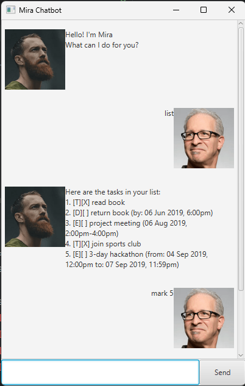

# Mira User Guide



Mira chatbot is your personal task assistant and helps manage expenses.

## Installation
1. Download the jar from [release](https://github.com/GavinSin/ip/releases).
2. Download Java SDK version 17.0.
3. Run command
    ```bash
    java -jar mira.jar
    ```

## Adding a Todo item
Adds a todo item with description to the task list.

Format:
```
todo <description>
```
Example:
```
todo read book
```
Returns a description of the todo item specified.
```
Got it. I've added this task:
  [T][] read book
Now you have 1 tasks in the list.
```

## Adding an Event item
Adds an event item with start and end date to the task list.

Format:
```
event <description> /from d/M/yyyy HHmm /to d/M/yyyy HHmm
```
Example:
```
event project meeting /from 6/8/2019 1400 /to 6/8/2019 1600
```
Returns a description of the event item specified.
```
Got it. I've added this task:
  [E][] project meeting (06 Aug 2019,
  2:00pm-4:00pm)
Now you have 2 tasks in the list.
```

## Adding a deadline item
Adds a deadline item with specified description and deadline to the task list.

Format:
```
deadline <description> /by d/M/yyyy HHmm
```
Example:
```
deadline return book /by 6/6/2019 1800
```
Returns a description of the deadline item specified.
```
Got it. I've added this task:
  [D][] return book (by: 06 Aug 2019, 6:00pm)
Now you have 3 tasks in the list.
```

## Listing all tasks in task list
List all tasks in the task list in the order time.

Format:
```
list
```
Returns the task list.
```
Here are the tasks in your list:
1. [T][] read book
2. [E][] project meeting (06 Aug 2019,
  2:00pm-4:00pm)
3. [D][] return book (by: 06 Aug 2019, 6:00pm)
```

## Deleting a task item
Deletes a task item with the numbering in the task list.

Format:
```
delete <number>
```
Example:
```
delete 3
```
Returns a description of the deleted item specified and the numbers of tasks left.
```
Noted. I've removed this task:
  [D][] return book (by: 06 Aug 2019, 6:00pm)
Now you have 2 tasks in the list.
```

## Mark a task item
Mark a task item with the numbering in the task list.

Format:
```
mark <number>
```
Example:
```
mark 2
```
Returns a description of the marked item specified.
```
Nice. I've marked this task as done:
  [T][X] read book
```

## Unmark a task item
Unmark a task item with the numbering in the task list.

Format:
```
unmark <number>
```
Example:
```
unmark 2
```
Returns a description of the unmarked item specified.
```
Nice. I've marked this task as not done yet:
  [T][] read book
```

## Find task items via keyword
Find all associated task items with a keyword string.

Format:
```
find <keyword>
```
Example:
```
find book
```
Returns a list of task items containing the keyword.
```
Here are the matching tasks in your list:
1. [T][] read book
3. [D][] return book (by: 06 Aug 2019, 6:00pm)
```

## Adding an expense
Adds an expense with specified description, category and amount in expense list.

Format:
```
expense <description> /category <category> /amount <amount>
```
Example:
```
expense takoyaki /category food /amount 2.50
```
Returns a description of the expense item specified.
```
Got it. I've added this expense:
  [food] $2.50 - takoyaki
Now you have 1 expenses in the list.
```

## Listing expenses
List all expenses in the expense list.

Format:
```
list expenses
```
Returns all description of the expenses in expense list.
```
Here are your recorded expenses:
1. [food] $2.50 - takoyaki
```

## Exiting command
Format:
```
bye
```
Returns goodbye message.
```
Bye. Hope to see you again soon!
```

## Acknowledgements

1. I have written the required code myself, and use ChatGPT to generate alternative implementations, use to improve my own coding skills.
2. I have referenced AB3 repository for code design inspiration.
3. I have referenced the JavaFx tutorial guide for GUI implementation.